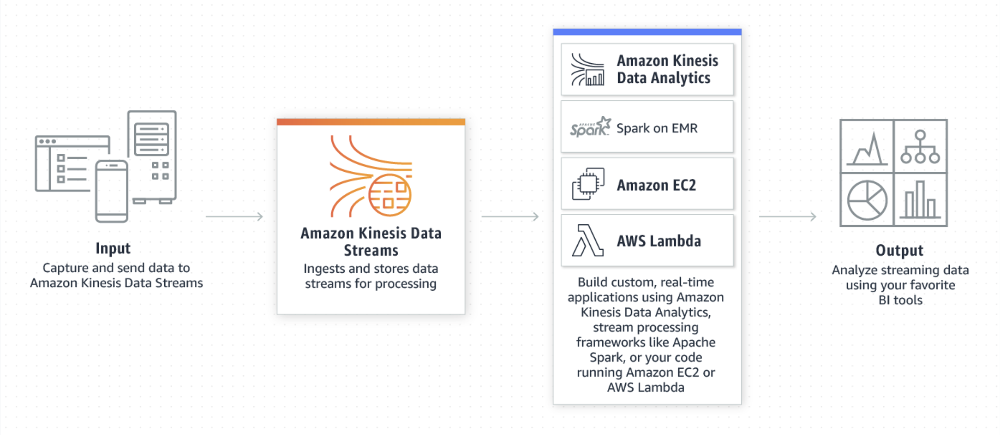

# Kinesis Lambda Consumer

This repo will be store all the relevant infrastructure as code and source code required to consume data from Kinesis, 
through AWS Lambda.

## Kinesis Background

The Kinesis service from AWS makes it easy to collect, process, and analyze real-time streaming data, so you can get 
timely insights and react quickly to new information. Kinesis will ingest real time data of different formats, enabling
users to process and analyse data as it arrives.

### Kinesis Data Stream

A data stream is a set of Shards. A **Shard** is a uniquely identified sequence of data records. Each shard can support
up to 5 transactions per second for reads, and 1000 transactions for writes. The data capacity of your stream is a 
function of the number of shards that you specify.

A **consumer** is an application that can be used to process the data from a data stream. A lambda could be used to 
process data from a data stream. Lambda will read records from a stream, and invoke the Lambda function synchronously 
with an event that contains stream records.

## Overview

This project will use Kinesis Data Stream to capture some data from a producer, and should hopefully set  up AWS Lambda
to consume the real time data that is being ingested into Kinesis.

## Resources

[Using AWS Lambda with Amazon Kinesis](https://docs.aws.amazon.com/lambda/latest/dg/with-kinesis.html)